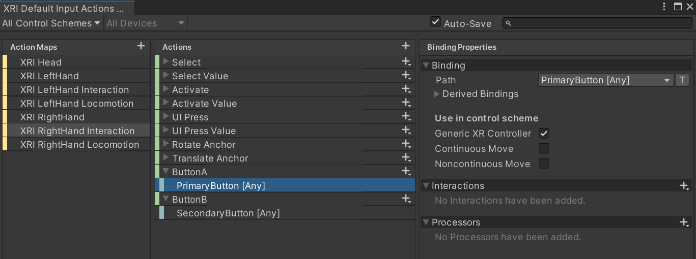

# VR-OXR-Interaction-Buttons
VR OpenXR Button Interaction

Script for using the Oculus A/B Buttons in the "Created with VR"[^1] Unity Tutorial.
Update for the Masterlecture 2024[^2] at FH JOANNEUM.

Used Packages:
* OpenXR Plugin
* Universal RP (Render Pipeline)
* XR Plugin Management
* XR Interaction Toolkit

Create two new InputActions with the new InputManager
* Button A: Primary Button
* Button B: Secondary Button
* Use the Script [XRButtonsAB.cs](./scripts/XRButtonsAB.cs)
* Check the Consolen Output (via Oculus Link)
  
[^1]: https://learn.unity.com/course/create-with-vr
[^2]: \Data\1_dev\1_unity\2024_aim\VRoom_v16_error30\Assets\Scripts
[^3]: \Users\nisch\Bilder\Screenshots

